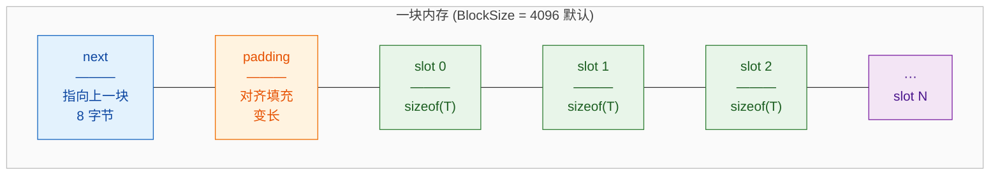

> 几乎所有用到 `std::allocator<T>` 的地方都可以用本项目的 `MemoryPool<T>` 完美替换。

一个高性能 C++ 内存池，完全兼容 STL Allocator 标准接口，可作为自定义分配器无缝接入标准库容器（`vector`、`list`、`map` 等），也可独立替代 `new`/`delete` 使用。

---

## 什么是内存池

**内存池是一种预分配内存并进行重复利用的技术**，通过减少频繁的动态内存分配与释放操作，从而提高程序运行效率。

内存池通常预先分配一块大的内存区域，将其划分为多个小块，每次需要分配内存时直接从这块区域中分配，而不是调用系统的动态分配函数（如 `new` 或 `malloc`）。

简单来说就是申请一块较大的内存块（不够继续申请），之后将这块内存的管理放在应用层执行，减少系统调用带来的开销。

### 核心优势

| 特性 | 内存池 | 系统分配 (`new`/`malloc`) |
|---|---|---|
| 分配速度 | 快（多数情况 O(1) 取空闲槽） | 慢（涉及系统调用、内核态切换） |
| 内存碎片 | 低（统一管理块，复用回收槽） | 高（频繁分配/释放导致碎片化） |
| 回收复用 | 支持（空闲链表回收机制） | 不支持（归还操作系统） |
| 适用场景 | 大量小对象频繁创建/销毁 | 通用场景 |

---

## 什么是 `std::allocator<T>`

`std::allocator<T>` 是 C++ 标准库的默认内存分配器，是所有 STL 容器（`vector`/`string`/`map` 等）的默认内存管理组件，核心设计是**分离内存分配与对象生命周期**。

### 核心接口

| 接口 | 功能 |
|---|---|
| `allocate(n)` | 分配可容纳 `n` 个 `T` 对象的原始未初始化内存，返回 `T*`，不执行对象构造 |
| `deallocate(p, n)` | 释放 `p` 指向的内存块，仅回收内存、不析构对象，`n` 必须与分配时一致 |
| `construct(p, args...)` / `destroy(p)` | 原地构造/析构对象（C++17 起由 `std::allocator_traits` 统一提供） |

### 关键特性

- 默认实现无成员数据，同类型分配器可互相释放对方分配的内存
- 默认通过 `::operator new` / `::operator delete` 从堆分配内存
- 所有 STL 容器支持替换为自定义分配器

> **设计价值**：将"内存申请"与"对象创建"分离，让容器可以预分配内存（减少系统调用次数），同时为自定义内存管理提供了统一的标准接口。

---

## 项目结构

```
MemoryPool/
├── include/
│   ├── MemoryPool.h          
│   └── MemoryPool.tcc        
├── tests/
│   ├── StackAlloc.h          
│   ├── test1.cpp             
│   └── test2.cpp             
└── README.md
```

默认内存块大小 `BlockSize = 4096` 字节，可通过模板参数自定义：

```cpp
MemoryPool<int>              pool1;  // 默认 4096 字节/块
MemoryPool<int, 8192>        pool2;  // 8192 字节/块
MemoryPool<std::string, 256> pool3;  // 256 字节/块（适合小对象）
```

`BlockSize` 经 `static_assert` 校验，必须 >= `2 * sizeof(Slot_)`，确保每块至少容纳一个槽。

---

## 基本使用

### 作为 STL 容器分配器

```cpp
#include "include/MemoryPool.h"
#include <vector>
#include <list>

int main()
{
    std::vector<int, MemoryPool<int>> vec;
    for (int i = 0; i < 1000; ++i)
        vec.push_back(i);

    std::list<std::string, MemoryPool<std::string>> lst;
    lst.reserve(5);
    lst.emplace_back("hello");
    lst.emplace_back("world");

    return 0;
}
```

### 替代 new/delete

```cpp
#include "include/MemoryPool.h"

int main() {
    MemoryPool<int> pool;

    int* p1 = pool.newElement(42);
    int* p2 = pool.newElement(100);

    // 析构 + 回收内存（放回空闲链表）
    pool.deleteElement(p1);
    pool.deleteElement(p2);

    return 0;
}
```

### 编译运行测试

```bash
# Test 1: MemoryPool vs new/delete（不同对象大小）
g++ tests/test1.cpp -o test1 && ./test1

# Test 2: 多分配器三方对比
g++ tests/test2.cpp -o test2 && ./test2
```

---

## 核心设计

### 内存布局

每次调用 `allocateBlock()` 申请一块 `BlockSize` 大小的内存，结构如下：



- **next**：指向上一块内存，形成**块链表**，析构时沿链释放所有块
- **padding**：`padPointer()` 计算的对齐填充，确保 `slot` 起始地址满足 `alignof(T)`
- **slot**：每个槽大小 = `sizeof(Slot_)` = `max(sizeof(T), sizeof(Slot_*))`

### `Slot_` 联合体

```cpp
union Slot_ 
{
    value_type element;  // 使用时：存储实际对象
    Slot_*     next;     // 空闲时：指向下一个空闲槽（链表节点）
};
```

空闲槽复用对象内存空间来存储链表指针，**零额外内存开销**。

### 分配流程

```
freeSlots_  非空？ ──是──> 从空闲链表头部取（O(1)）
    │ 否
    ↓
currentSlot_ < lastSlot_  ？ ──是──> 取  currentSlot_  并 ++
    │ 否
    ↓
allocateBlock()  ──> 更新  currentSlot_ / lastSlot_  ──> 返回新槽
```

1. 优先检查**空闲链表** `freeSlots_`，如果不为空则 O(1) 返回空闲链表头部内存(`freeSlots_`后移一位)
2. 再看**当前内存块**是否有剩余槽，有则直接推进 `currentSlot_`
3. 都没有则调用 `allocateBlock()` 分配新块，重置内部指针

### 释放流程

```
deallocate(p) ──> p 转为 slot_pointer_ ──> 插入 freeSlots_ 头部
```

释放的内存不回给操作系统，插入**空闲链表头部**等待复用(将内存管理放到应用层)。

### 析构 `MemoryPool` 

```
~MemoryPool() ──> 沿 currentBlock_ 链表 ──> ::operator delete 逐块释放
```  
只需释放已经申请的所有内存块，空闲链表无需理会

---

## 基准测试

项目内置两个测试程序，可直接编译运行验证性能。

### Test 1 — `newElement/deleteElement` vs `new/delete`

对 4 种不同大小的对象（`P1`=4B, `P2`=20B, `P3`=40B, `P4`=80B）各进行 **1,000,000 × 50 轮** 分配/释放：

```cpp
// 测试对象定义
class P1 { int id_; };               //  4 字节
class P2 { int id_[5]; };            // 20 字节
class P3 { int id_[10]; };           // 40 字节
class P4 { int id_[20]; };           // 80 字节
```

```cpp
// MemoryPool 路径
MemoryPool<P1> mem1;
// ...
P1* p1 = mem1.newElement();
mem1.deleteElement(p1);

// 对比: 原生 new/delete
P1* p1 = new P1;
delete p1;
```

### Test 2 — 三种方案三方对比

基于同一个栈数据结构 `StackAlloc`，对比三种内存管理方案各进行 **1,000,000 × 50 轮** push/pop：

```cpp
// 方案 A: 默认分配器
StackAlloc<int, std::allocator<int>> stackDefault;

// 方案 B: MemoryPool
StackAlloc<int, MemoryPool<int>> stackPool;

// 方案 C: std::vector（通常最快，作为参考基准）
std::vector<int> stackVector;
```

> Test 2 中 `StackAlloc.h` 的设计来源于 Cosku Acay，用于演示 allocator 可插拔特性：同一个数据结构只需切换模板参数即可更换底层分配器。

---

## API 参考

### Allocator 标准接口

| 接口 | 说明 |
|---|---|
| `allocate(n=1, hint=nullptr)` | 分配 `n` 个 `T` 的未初始化内存（当前一次分配一个） |
| `deallocate(p, n=1)` | 回收 `p` 指向的内存，放入空闲链表 |
| `construct(p, args...)` | 在已分配内存上原地构造对象（placement new） |
| `destroyed(p)` | 手动调用对象析构函数 |
| `address(x)` | 返回对象地址 |
| `max_size()` | 返回理论最大可分配对象数量 |

### 便捷方法

| 接口 | 说明 |
|---|---|
| `newElement(args...)` | `allocate()` + `construct()` — 一步完成分配和构造 |
| `deleteElement(p)` | `destroyed()` + `deallocate()` — 一步完成析构和回收 |

### 类型萃取（Traits）

```cpp
typedef T               value_type;
typedef T*              pointer;
typedef T&              reference;
typedef const T*        const_pointer;
typedef const T&        const_reference;
typedef size_t          size_type;
typedef ptrdiff_t       difference_type;

// 传播策略
typedef std::false_type propagate_on_container_copy_assignment;  // 拷贝不传播
typedef std::true_type  propagate_on_container_move_assignment;  // 移动传播
typedef std::true_type  propagate_on_container_swap;             // swap 传播

// MemoryPool<T>::rebind<U>::other => MemoryPool<U>
template <typename U>
struct rebind { typedef MemoryPool<U> other; };
```

### 特殊成员函数

| 函数 | 行为 |
|---|---|
| `MemoryPool()` | 默认构造，所有指针初始化为 `nullptr` |
| `MemoryPool(const MemoryPool&)` | 拷贝构造 = 创建空池（不共享内部状态） |
| `MemoryPool(MemoryPool&&)` | 移动构造：转移所有指针，源对象置空 |
| `MemoryPool<T>(const MemoryPool<U>&)` | 跨类型拷贝构造 = 创建空池 |
| `operator=(const MemoryPool&)` | **禁用** (`= delete`)，防止意外共享 |
| `operator=(MemoryPool&&)` | 移动赋值：`std::swap` 交换内部指针 |
| `~MemoryPool()` | 遍历块链表，`::operator delete` 释放所有内存 |

---

## 与 std::allocator 对比

| 维度 | `std::allocator<T>` | `MemoryPool<T>` |
|---|---|---|
| 底层分配 | `::operator new` 逐次调用 | 预分配大块 + 内部管理 |
| 内存回收 | 立即归还操作系统 | 放回空闲链表，延迟复用 |
| 系统调用次数 | 每次分配/释放各一次 | 只在块耗尽时调用 |
| 内存碎片 | 可能产生外部碎片 | 块内连续，碎片低 |
| 频繁小对象 | 性能差 | **性能优** |
| 无状态性 | 是 | 否（持有内部指针） |
| 拷贝语义 | 浅拷贝（安全） | 拷贝构造 = 空池；拷贝赋值禁用 |
| 移动语义 | 等价于拷贝 | O(1) 指针交换 |
